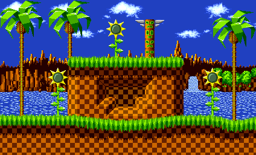

# Tilemap2Animation


[](https://github.com/vonhoff/TilemapToAnimation/releases)
[](LICENSE)

Tilemap2Animation is a command-line tool that converts a Tiled tilemap (TMX) into an animated GIF, allowing you to
transform tile-based designs from [Tiled](https://www.mapeditor.org/) and other game development tools into seamless
animated GIFs.

## Features

- **TMX to GIF Conversion** - Convert Tiled tilemaps directly into animated GIFs
- **Automatic File Resolution** - Automatically finds related TMX, TSX, and image files
- **Animation Generation** - Creates smooth animations from tilemap layers
- **Frame Delay Control** - Customize animation timing for the perfect result

## Limitations

- Only orthographic maps are supported at this time
- Only GIF output format is available

## Example

Convert a tileset and tilemap into a GIF animation:

|                          From                          |                         To                          |
|:------------------------------------------------------:|:---------------------------------------------------:|
|  |  |

## Getting Started

### Installation

1. Ensure you have [.NET 10 runtime](https://dotnet.microsoft.com/en-us/download/dotnet/10.0) installed.
2. Download the latest release from the [releases page](https://github.com/vonhoff/TilemapToAnimation/releases).
3. Extract the zip file to your preferred location.

### Usage

```
tilemap2animation -i <input file> -o <output GIF file>
```

The input file can be:

- A TMX tilemap file
- A TSX tileset file
- A tileset image file (the tool will try to find related TMX and TSX files)

For a full list of options, use:

```
tilemap2animation --help
```

## Related Projects

For converting GIFs back to tilemaps, check out [Animation2Tilemap](https://github.com/vonhoff/Animation2Tilemap).

## Support and Contribute

If you find value in this project, there are several ways you can contribute:

- Give the [project](https://github.com/vonhoff/Tilemap2Animation) a star on GitHub.
- Support the project through [GitHub Sponsors](https://github.com/sponsors/vonhoff).
- Improve documentation, report bugs, or submit pull requests.

## License

TilemapToAnimation is open-source software licensed under the [MIT License](LICENSE).
